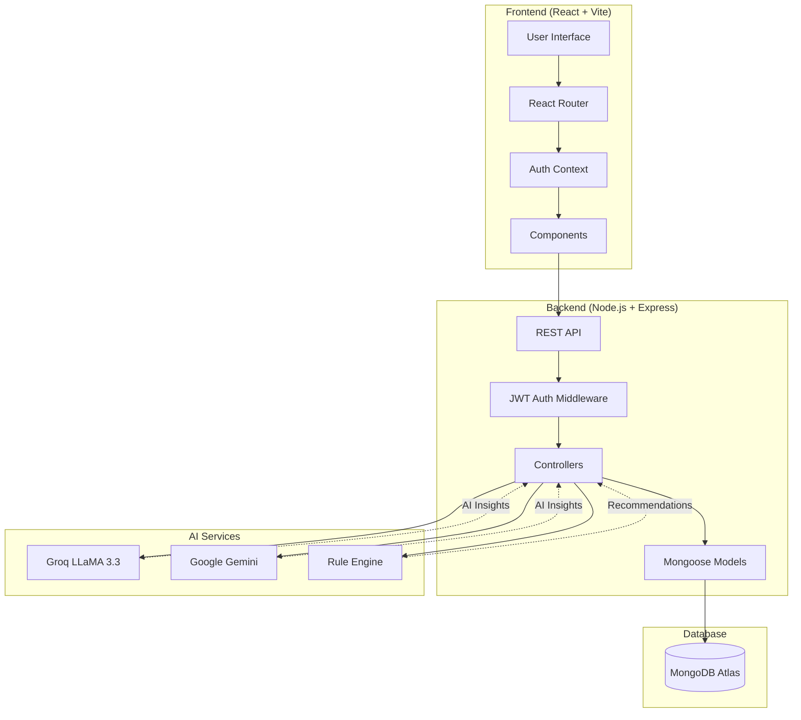
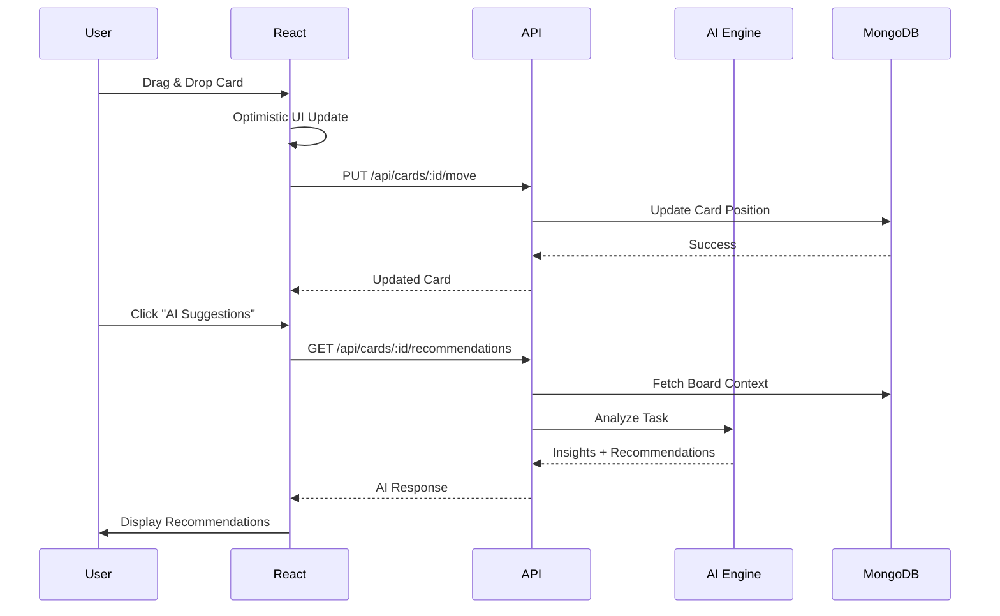

# 🚀 SmartBoard - AI-Powered Task Management Platform

<div align="center">


**An intelligent, collaborative task management platform with AI-powered recommendations, drag-and-drop interface, and real-time team collaboration.**

[Features](#-features) • [Tech Stack](#-tech-stack) • [Getting Started](#-getting-started) • [Architecture](#-architecture) • [Deployment](#-deployment)

</div>

---

## 🛠 Tech Stack

### Frontend


- **React 18.3.1** - Modern UI library with hooks and context
- **Vite 5.4.2** - Lightning-fast build tool and dev server
- **TailwindCSS 3.4.0** - Utility-first CSS framework for rapid UI development
- **React Router DOM 6.20.0** - Client-side routing
- **@hello-pangea/dnd 18.0.1** - Beautiful drag-and-drop for lists and cards
- **qrcode.react 4.2.0** - QR code generation for easy board sharing

### Backend


- **Node.js 18+** - JavaScript runtime
- **Express 4.18.2** - Fast, minimalist web framework
- **MongoDB 8.0.0** (via Mongoose) - NoSQL database for flexible data storage
- **JWT (jsonwebtoken 9.0.2)** - Secure authentication and authorization
- **bcryptjs 2.4.3** - Password hashing

### AI & Intelligence


- **Groq SDK 0.37.0** - Ultra-fast LLM inference with LLaMA 3.3 70B
- **Google Generative AI 1.30.0** - Gemini model integration
- **Custom AI Recommendation Engine** - Rule-based + AI-powered task insights

---

## ✨ Features

### 🎯 Core Functionality
- **📋 Kanban Board System** - Create unlimited boards with custom lists (To Do, In Progress, Done, etc.)
- **🎨 Drag & Drop Interface** - Intuitive card movement between lists with smooth animations
- **✏️ Rich Card Management** 
  - Title, description, and labels
  - Due date tracking with visual indicators
  - Inline editing and quick actions
  - Card archiving and deletion

### 🤖 AI-Powered Intelligence
- **✨ Smart Recommendations** - AI analyzes your tasks and suggests:
  - Optimal due dates based on task complexity
  - Priority levels (High/Medium/Low)
  - Estimated effort and time requirements
  - Actionable next steps and potential blockers
  - Ideal list placement
- **🧠 Contextual Insights** - AI understands your board context and other tasks
- **⚡ Real-time Analysis** - Powered by Groq's ultra-fast LLaMA 3.3 70B model

### 👥 Collaboration Features
- **🔗 Share Links** - One-click shareable board links
- **📱 QR Code Sharing** - Generate and download QR codes for instant mobile access
- **🌐 Multi-Platform Sharing** - Direct share to WhatsApp, Telegram, Email, Twitter
- **👤 Team Members** - View all board collaborators with roles
- **🔓 Auto-Join** - Anyone with the link can join and collaborate

### 🔐 Security & Authentication
- **🔒 JWT Authentication** - Secure user sessions
- **🔑 Password Encryption** - bcrypt hashing for user credentials
- **👮 Protected Routes** - Private board access control
- **🎫 Token-Based API** - Secure backend communication

### 🎨 User Experience
- **🌈 Modern UI** - Gradient designs, glassmorphism, smooth transitions
- **📱 Responsive Design** - Works seamlessly on desktop, tablet, and mobile
- **⚡ Fast Performance** - Optimistic UI updates for instant feedback
- **🎭 Hover Effects** - Interactive elements with beautiful micro-animations
- **🔔 Real-time Feedback** - Loading states, success/error messages

---

## 📁 Project Structure

```
CollabSpaceAI/
│
├── client/                      # Frontend React application
│   ├── src/
│   │   ├── components/          # Reusable UI components
│   │   │   ├── CreateBoardModal.jsx
│   │   │   ├── CreateCardModal.jsx
│   │   │   ├── CreateListModal.jsx
│   │   │   ├── EditCardModal.jsx
│   │   │   ├── RecommendationsPanel.jsx   # AI insights UI
│   │   │   ├── PrivateRoute.jsx
│   │   │   └── LoadingSpinner.jsx
│   │   │
│   │   ├── pages/               # Full-page components
│   │   │   ├── Login.jsx
│   │   │   ├── Register.jsx
│   │   │   ├── Boards.jsx       # Dashboard with all boards
│   │   │   └── Board.jsx        # Main kanban board view
│   │   │
│   │   ├── context/             # Global state management
│   │   │   └── AuthContext.jsx  # User authentication context
│   │   │
│   │   ├── utils/               # API and helper functions
│   │   │   ├── api.js           # Auth API calls
│   │   │   └── boardsApi.js     # Boards, lists, cards API
│   │   │
│   │   ├── App.jsx              # Main app component + routing
│   │   ├── main.jsx             # React entry point
│   │   └── index.css            # Global styles
│   │
│   ├── public/                  # Static assets
│   ├── package.json
│   ├── vite.config.js
│   ├── tailwind.config.js
│   └── vercel.json              # Vercel deployment config
│
└── server/                      # Backend Node.js application
    ├── config/
    │   └── db.js                # MongoDB connection
    │
    ├── models/                  # Mongoose schemas
    │   ├── User.js
    │   ├── Board.js
    │   ├── List.js
    │   └── Card.js
    │
    ├── controllers/             # Business logic
    │   ├── authController.js    # Login, register, user management
    │   ├── boardController.js   # Board CRUD operations
    │   ├── listController.js    # List management
    │   └── cardController.js    # Card operations + AI integration
    │
    ├── routes/                  # API endpoints
    │   ├── auth.js              # /api/auth/*
    │   ├── boards.js            # /api/boards/*
    │   ├── lists.js             # /api/lists/*
    │   └── cards.js             # /api/cards/*
    │
    ├── middleware/
    │   └── auth.js              # JWT verification middleware
    │
    ├── utils/                   # Helper functions
    │   ├── groqAI.js            # Groq AI integration
    │   ├── gemini.js            # Google Gemini integration
    │   └── recommendations.js   # Rule-based recommendations
    │
    ├── index.js                 # Server entry point
    ├── package.json
    └── .env.example             # Environment variables template
```

---

## 🏗 Architecture

### System Design



### Data Flow



### Database Schema

#### **User Collection**
```javascript
{
  _id: ObjectId,
  name: String,
  email: String (unique),
  password: String (hashed),
  createdAt: Date
}
```

#### **Board Collection**
```javascript
{
  _id: ObjectId,
  title: String,
  description: String,
  owner: ObjectId (ref: User),
  members: [{
    user: ObjectId (ref: User),
    role: String (admin/member)
  }],
  createdAt: Date,
  updatedAt: Date
}
```

#### **List Collection**
```javascript
{
  _id: ObjectId,
  title: String,
  board: ObjectId (ref: Board),
  position: Number,
  createdAt: Date
}
```

#### **Card Collection**
```javascript
{
  _id: ObjectId,
  title: String,
  description: String,
  list: ObjectId (ref: List),
  board: ObjectId (ref: Board),
  position: Number,
  dueDate: Date,
  labels: [String],
  assignedTo: [ObjectId (ref: User)],
  createdBy: ObjectId (ref: User),
  createdAt: Date,
  updatedAt: Date
}
```

### API Architecture

#### **RESTful Endpoints**

```
Authentication:
POST   /api/auth/register    - Create new user
POST   /api/auth/login       - Login user
GET    /api/auth/me          - Get current user

Boards:
GET    /api/boards           - Get user's boards
POST   /api/boards           - Create new board
GET    /api/boards/:id       - Get specific board
PUT    /api/boards/:id       - Update board
DELETE /api/boards/:id       - Delete board
POST   /api/boards/:id/invite - Invite user to board

Lists:
GET    /api/lists/board/:id  - Get all lists for board
POST   /api/lists            - Create new list
PUT    /api/lists/:id        - Update list
DELETE /api/lists/:id        - Delete list

Cards:
GET    /api/cards/board/:id  - Get all cards for board
GET    /api/cards/list/:id   - Get cards for specific list
POST   /api/cards            - Create new card
GET    /api/cards/:id        - Get specific card
PUT    /api/cards/:id        - Update card
DELETE /api/cards/:id        - Delete card
PUT    /api/cards/:id/move   - Move card to different list
PUT    /api/cards/reorder    - Reorder cards
GET    /api/cards/:id/recommendations - Get AI insights ✨
```

### AI Recommendation Engine

The platform uses a **hybrid AI approach**:

1. **Rule-Based Engine** (`recommendations.js`)
   - Analyzes task patterns
   - Suggests due dates based on complexity
   - Identifies overdue tasks
   - Recommends priority levels

2. **Groq AI Integration** (`groqAI.js`)
   - Uses LLaMA 3.3 70B model
   - Ultra-fast inference (< 1 second)
   - Contextual understanding of board state
   - Natural language insights

3. **Google Gemini** (`gemini.js`)
   - Fallback AI provider
   - Advanced reasoning capabilities
   - Multi-modal understanding

**AI Insights Include:**
- 📅 Due date suggestions with reasoning
- 🎯 Priority classification
- ⏱️ Effort estimation
- 📝 Actionable step breakdowns
- ⚠️ Potential blocker identification
- 🔄 List movement recommendations

---

## 🚀 Getting Started

### Prerequisites

- **Node.js 18+** installed
- **MongoDB** (local or Atlas account)
- **Groq API Key** (get from [groq.com](https://groq.com))
- **Git** for version control

### Installation

#### 1️⃣ Clone the Repository
```bash
git clone https://github.com/yourusername/CollabSpaceAI.git
cd CollabSpaceAI
```

#### 2️⃣ Backend Setup
```bash
cd server
npm install
```

Create `.env` file:
```env
PORT=5000
MONGO_URI=your_mongodb_connection_string
JWT_SECRET=your_super_secret_jwt_key_here
GROQ_API_KEY=your_groq_api_key_here
```

Start backend server:
```bash
npm run dev
```

Backend runs on: `http://localhost:5000`

#### 3️⃣ Frontend Setup
```bash
cd client
npm install
```

Create `.env` file (optional):
```env
VITE_API_URL=http://localhost:5000
```

Start frontend dev server:
```bash
npm run dev
```

Frontend runs on: `http://localhost:5173`

#### 4️⃣ Access the Application
1. Open browser to `http://localhost:5173`
2. Register a new account
3. Create your first board
4. Start managing tasks! 🎉

---

## 📦 Deployment

### Frontend (Vercel)

1. **Push to GitHub**
   ```bash
   git add .
   git commit -m "Ready for deployment"
   git push origin main
   ```

2. **Deploy on Vercel**
   - Go to [vercel.com](https://vercel.com)
   - Click "Import Project"
   - Select your repository
   - Configure:
     - **Framework**: Vite
     - **Root Directory**: `client`
     - **Build Command**: `npm run build`
     - **Output Directory**: `dist`

3. **Environment Variables** (in Vercel dashboard)
   ```
   VITE_API_URL=https://your-backend.render.com
   ```

### Backend (Render)

1. **Create Web Service on Render**
   - Go to [render.com](https://render.com)
   - Click "New +" → "Web Service"
   - Connect your GitHub repository

2. **Configure Service**
   - **Root Directory**: `server`
   - **Build Command**: `npm install`
   - **Start Command**: `npm start`

3. **Environment Variables**
   ```
   MONGO_URI=your_mongodb_atlas_connection_string
   JWT_SECRET=your_production_jwt_secret
   GROQ_API_KEY=your_groq_api_key
   PORT=5000
   ```

4. **Deploy** 🚀

### MongoDB (Atlas)

1. Create free cluster at [mongodb.com/cloud/atlas](https://www.mongodb.com/cloud/atlas)
2. Create database user
3. Whitelist IP addresses (or use 0.0.0.0/0 for development)
4. Get connection string
5. Add to backend `.env`

---

## 🎯 Usage Examples

### Creating a Board
1. Click "Create New Board" on dashboard
2. Enter board name and description
3. Click "Create" - your Kanban board is ready!

### Adding Tasks
1. Click "+ Add a card" in any list
2. Fill in title, description, labels
3. Set due date (or let AI suggest one)
4. Click "Create Card"

### Getting AI Recommendations
1. Hover over any card
2. Click "✨ AI Suggestions"
3. View insights for:
   - Priority level
   - Estimated effort
   - Suggested due date
   - Action steps
   - Potential blockers

### Sharing a Board
1. Click "Share" button in header
2. Choose sharing method:
   - Copy link
   - Generate QR code
   - Share via WhatsApp/Telegram/Email
3. Collaborators can join instantly!

---

## 🤝 Contributing

Contributions are welcome! Here's how:

1. Fork the repository
2. Create feature branch (`git checkout -b feature/AmazingFeature`)
3. Commit changes (`git commit -m 'Add AmazingFeature'`)
4. Push to branch (`git push origin feature/AmazingFeature`)
5. Open Pull Request

---

## 📝 License

This project is licensed under the **MIT License** - see the [LICENSE](LICENSE) file for details.

---

## 👨‍💻 Author

**Mohd. Altamash Rizwi**

- GitHub: [@rizwimohdaltamash](https://github.com/rizwimohdaltamash)
- LinkedIn: [Your LinkedIn](https://linkedin.com/in/yourprofile)

---

## 🙏 Acknowledgments

- **React Team** - For the amazing library
- **Groq** - For ultra-fast AI inference
- **MongoDB** - For flexible data storage
- **Vercel & Render** - For easy deployment
- **TailwindCSS** - For beautiful, rapid UI development

---

## 📧 Support

For support, email altamashrizwi@example.com or open an issue on GitHub.

---

<div align="center">

**⭐ Star this repository if you find it helpful! ⭐**

Made with ❤️ by Altamash

</div>
